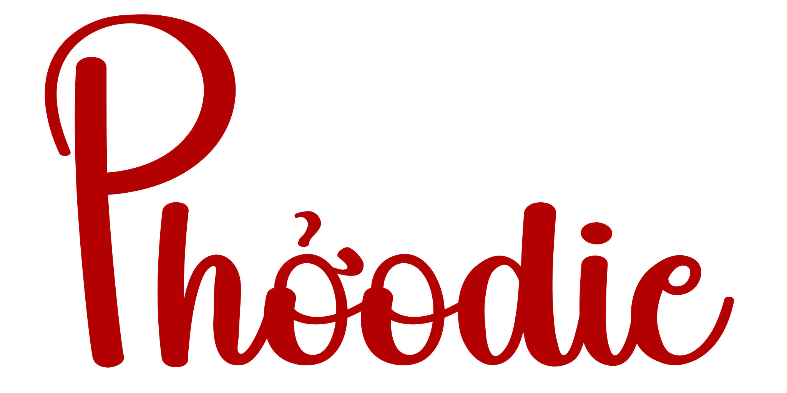

# [phoodie-chicago](https://phoodie-chicago.netlify.app/)

[![CC BY-NC-ND 4.0][cc-by-nc-nd-shield]][cc-by-nc-nd]

This work is licensed under a
[Creative Commons Attribution-NonCommercial-NoDerivs 4.0 International License][cc-by-nc-nd].

[![CC BY-NC-ND 4.0][cc-by-nc-nd-image]][cc-by-nc-nd]

[cc-by-nc-nd]: http://creativecommons.org/licenses/by-nc-nd/4.0/
[cc-by-nc-nd-image]: https://licensebuttons.net/l/by-nc-nd/4.0/88x31.png
[cc-by-nc-nd-shield]: https://img.shields.io/badge/License-CC%20BY--NC--ND%204.0-lightgrey.svg

#

This repository features the base code for the development of the website for Phởodie, a fictional Vietnamese restaurant, focused on traditional recipes served with a foodie mindset.

Featuring a clean layout with vibrant pictures showcasing Phởodie's delicious food, a table reservation and online order services.

In the table reservation page JSON data of the available booking times is fetched from the API. After filling out the (client-side validated) form, the data is then submitted to the API to process the booking.

#

<h3>Tech Stack:</h3>

* **React.js**
* **Tailwind**

#
#### Development by [andreDmelo](https://andredmelo.dev/)